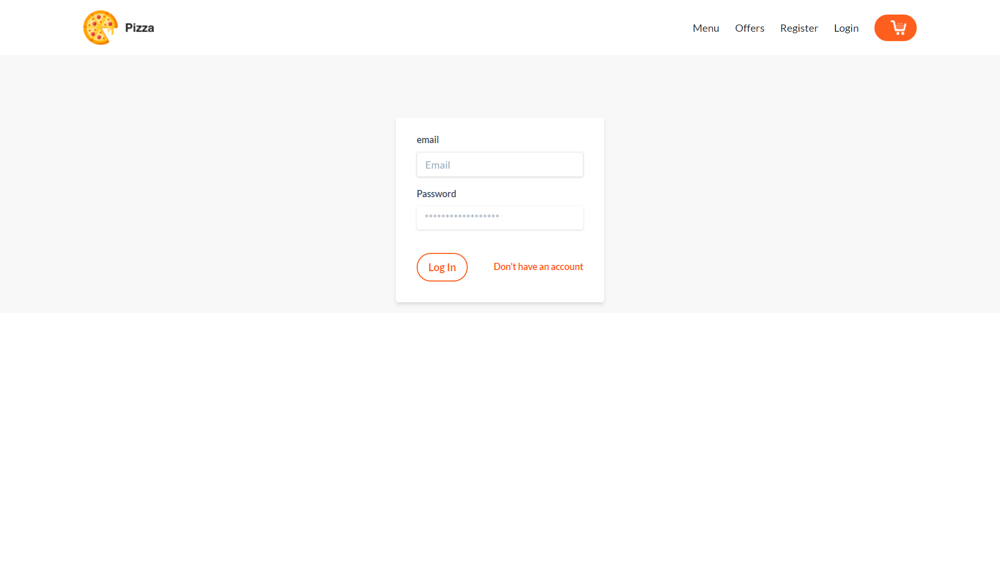
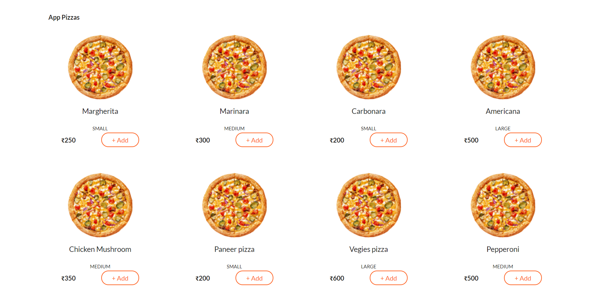
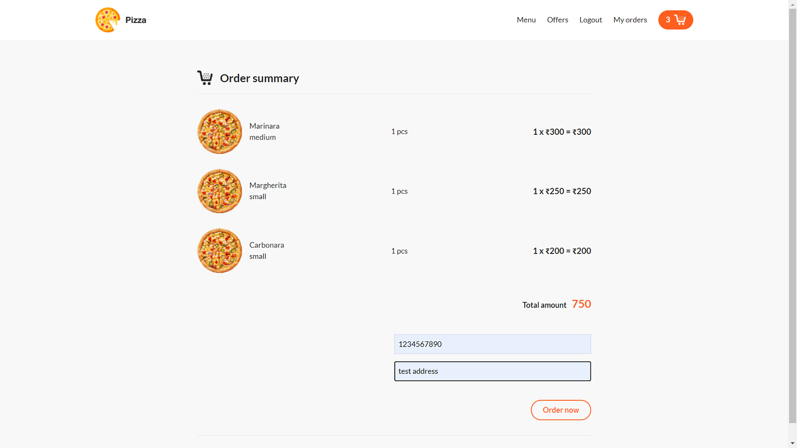
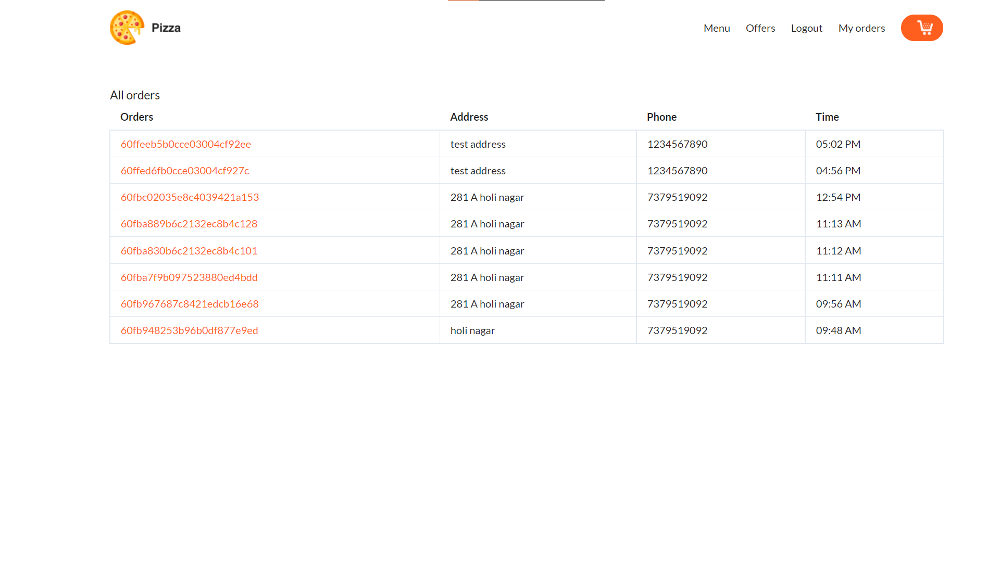
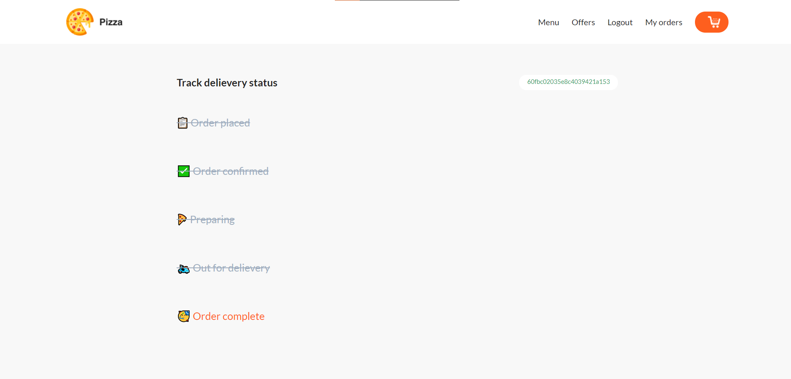
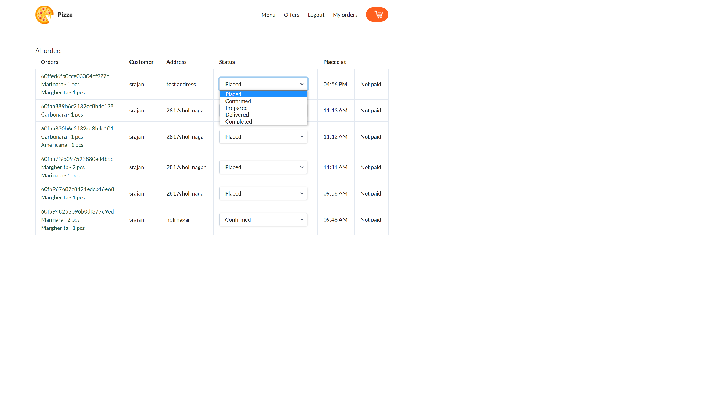

 # 🍕🍕A order placing and delievery website that let's the user track their orders live.

## About the app and tech used.

## 👩‍🎓 1. Authentication
### It uses the local session based authentication strategy of postman.
 
 ### The auth session remains for 24 hours, after that the cookie expires

## 📃 Placing the order
### Once the user has selected the items which he/she wants to buy from the following menu page.
  
### User can head over to Cart page. All of the things till here can be done without being logged in the orders selected are stored in the session, which means the orders will remain in the cart once the user signs in. Once the user is signed in. They will be able to place the order from the following cart page. (If unauthenticated, there will be login to continue button instead of order now)
  

### After placing the order, users will be redirected to all orders page.
 

## Tracking the order
### Each order od is a hyperlink which can be used to track individual orders.
 

## Admin side controls
### Admin has the authority to view all the orders and update their status.
 